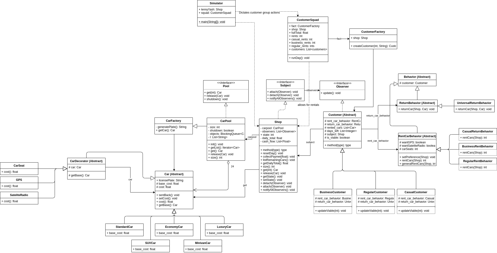

# Project 3

Team:
* Yash Gandhi
* Lenny Fobe

Langauge: Java

## Description

For this assignment we simulated the daily interactions a rental car shop has with its customers. Using object oriented programming we abstracted the problem into a set of interacting objects which take responsibility for handling the logic necessary for running this simulation. Using design patterns and OOP best practices, we developed this simulation to be resilient to new changes in the future.


## Installation and Usage

To run the car rental simulation, you'll first have to compile the the source files in this repo with:
```
javac *.java
```

Once the program is compiled, you can run the program with:
```
java Simulator
```

## UML Class Diagram

Bellow is the UML Class Diagram of car rental simulation. Note worthy design patterns include:
- Shop uses a CarPool (ObjectPool) to keep track of which cars are still in the shop
- The CarPool uses a CarFactory (SimpleFactory) to populate its Pool with specific Car objects (StandardCar, EconomyCar, LuxuryCar. etc.).
- Add-ons to cars, like GPS, SateliteRadios and CarSeats, are implemented as CarDecorators.
- To make Customer behavior easily extendible, we used a Strategy method for Customer Behavior. Where ConcreteCustomers (BusinessCustomers, RegularCustomers, etc.) delegate their rent and return behavior to RentBeavhior and ReturnBehavior abstract classes.
- Customer's are also implemented as Observer objects that observe the Shop. This allows customer's to get information from the shop when the day ends and lets them update their viablility, ultimately determining if they visit the store.
- The CustomerSquad uses a CustomerFactory (SimpleFactory) to create the Customers that interact in the simulation.




## Sample output
For a single day, the simulator outputs the following output:
- Day Number
- Number of cars in the Shop at the begining of the day
- License plates of cars in the Shop at the begining of the day
- List of active customers, and which cars they have, at the begining of the day
- Total number of active customers at the begining of the day
- Rental receipts of all rentals that occur that day
    - Rental receipts records the license plate, car type, add-ons and individual price of each car rented in a rental transaction.
    - Rental receipts also show the number of days for each rental, and the total cost of the entire rental.
- Total number of rentals that day
- Total money earned that day

```
----------------------------------------
Day: 33
Remaining Cars at the beginning of the day: 8
Cars left: SEP939, XMP249, SDA672, RMC431, EPG565, PIN677, HZK328, YTC780

 # # # Current Rental Situation # # # 
Laura currently has: 
QIM000, DUT800, 

Liam currently has: 
IHG701, JIY522, EUL132, 

Yash currently has: 
RNO226, PCH207, 

Chandler currently has: 
UPW639, 

Jim currently has: 
RAF071, YRO379, 

Phoebe currently has: 
DRS841, OKU584, 

Ross currently has: 
EQZ588, 

Rachel currently has: 
UFS634, KEY568, HBJ069, 

Number of cars out for rental: 16 
 
 # # # Rents for the Day # # # 
Yash's Rental Receipt (BusinessCustomer):
CarPlate CarType     GPS   Satellite     CarSeats Price     
-------------------------------------------------------
SEP939   LuxuryCar   true  false         0        $1425.00   
XMP249   SUVCar      false true          0        $1095.00   
SDA672   MinivanCar  false true          3        $1445.00   

Rental Duration: 7 Days
Rental Total Cost: $3965.0

Lenny's Rental Receipt (CasualCustomer):
CarPlate CarType     GPS   Satellite     CarSeats Price     
-------------------------------------------------------
RMC431   LuxuryCar   true  true          0        $270.00    

Rental Duration: 1 Days
Rental Total Cost: $270.0

Chandler's Rental Receipt (BusinessCustomer):
CarPlate CarType     GPS   Satellite     CarSeats Price     
-------------------------------------------------------
EPG565   MinivanCar  false false         2        $1410.00   
PIN677   EconomyCar  false false         3        $707.50    
HZK328   EconomyCar  true  true          3        $727.50    

Rental Duration: 7 Days
Rental Total Cost: $2845.0

Ross's Rental Receipt (CasualCustomer):
CarPlate CarType     GPS   Satellite     CarSeats Price     
-------------------------------------------------------
YTC780   EconomyCar  false false         1        $102.50    

Rental Duration: 1 Days
Rental Total Cost: $102.5

Daily Rentals: 8
Daily Total: 7182.5
```